# Silent Trap

### Detail:
A critical incident has occurred in Tales from Eldoria, trapping thousands of players in the virtual world with no way to log out. The cause has been traced back to Malakar, a mysterious entity that launched a sophisticated attack, taking control of the developers' and system administrators' computers. With key systems compromised, the game is unable to function properly, which is why players remain trapped in Eldoria. Now, you must investigate what happened and find a way to restore the system, freeing yourself from the game before it's too late.

```
1. What is the subject of the first email that the victim opened and replied to?
2. On what date and time was the suspicious email sent? (Format: YYYY-MM-DD_HH:MM) (for example: 1945-04-30_12:34)
3. What is the MD5 hash of the malware file?
4. What credentials were used to log into the attacker's mailbox? (Format: username:password)
5. What is the name of the task scheduled by the attacker?
6. What is the API key leaked from the highly valuable file discovered by the attacker?
```

### Solution:

Ta được cung cấp 1 file `.pcapng`. Ta tiến hành phân tích thì biết được phần lớn là communication giữa 2 IP là `192.168.91.173` và `192.168.91.133`

Trong đó `192.168.91.173` là của host mail server `mail.korptech.net` và `192.168.91.133` là của nạn nhân

#### Question 1: What is the subject of the first email that the victim opened and replied to? - Answer: `Game Crash on Level 5`

Email đầu tiên ta xác định được là ở stream thứ 4 của HTTP. Ở đây nó thể hiện nội dung preview của mail mà nạn nhân nhận được

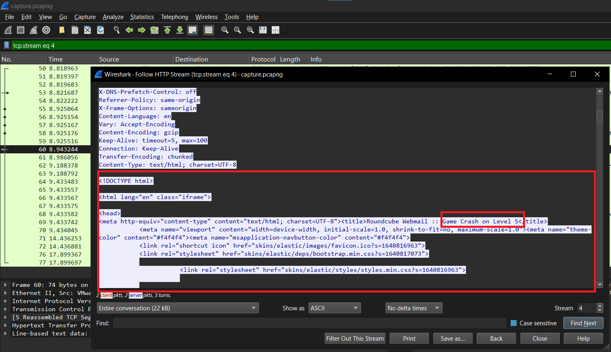

---

#### Question 2: On what date and time was the suspicious email sent? - Answer: `2025-02-24_15:46`

Trong stream thứ 8 của HTTP, ta thấy được 1 mail khá khả nghi với 1 file `.zip`

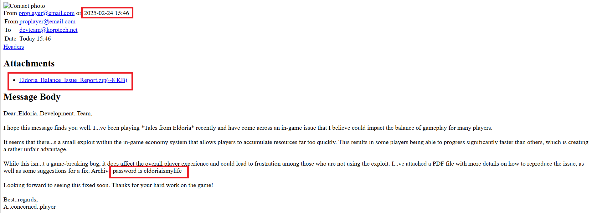 

Ta tiếp tục follow theo HTTP stream thì đến stream 12 là thông tin của file `.zip` này, ta biết được trong file `.zip` này có chứa 1 file `Eldoria_Balance_Issue_Report.pdf.exe`. 

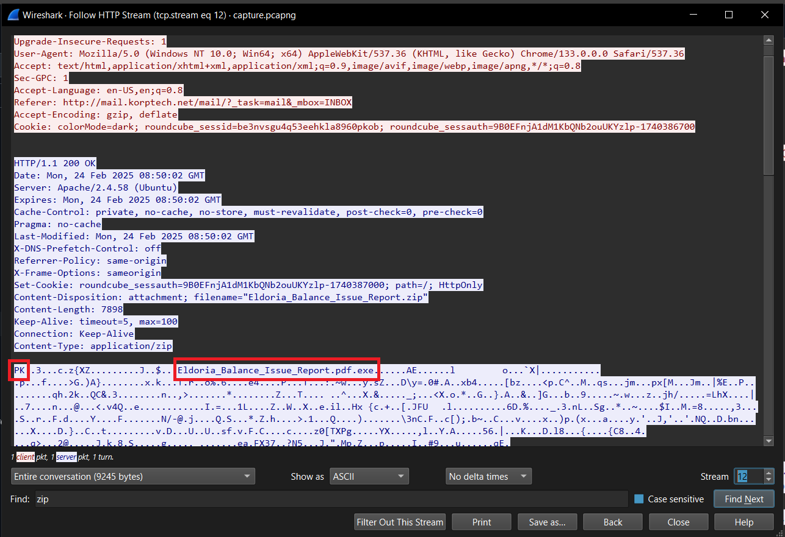

File này cực **sus** vì nó là file `.exe` - Technique này sẽ lừa được những người không để hiện extension của file. Mặc định lúc đầu máy tính của những người bình thường sẽ ẩn extension của file đi. Khi nó view trên máy sẽ là `.pdf`. Nạn nhân sẽ nghĩ nó là file pdf bình thường và mở nó lên, file sẽ chạy và bùm....

Ta kết luận được email khả nghi được gửi đi chính là mail có chứa file `.zip` và thời gian của nó là `2025-02-24 15:46`
 
---

#### Question 3: What is the MD5 hash of the malware file? - Answer: `c0b37994963cc0aadd6e78a256c51547`

Để biết được MD5 hash của malware, ta phải tiến hành giải nén trước tiên. Pass chúng ta có thể biết trong mail ở Question 2:

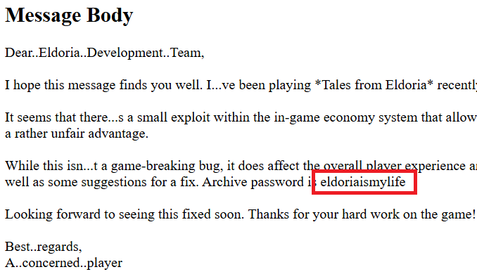

Pass: `eldoriaismylife`

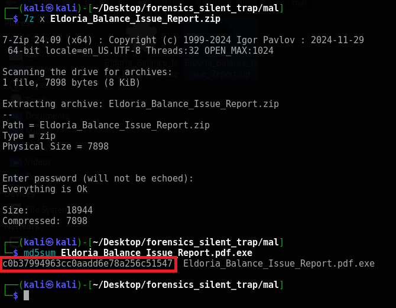

---

#### Question 4: What credentials were used to log into the attacker's mailbox? - Answer: `proplayer@email.com:completed`

Khi ta filter protocol `IMAP`, ta biết được thông tin đăng nhập

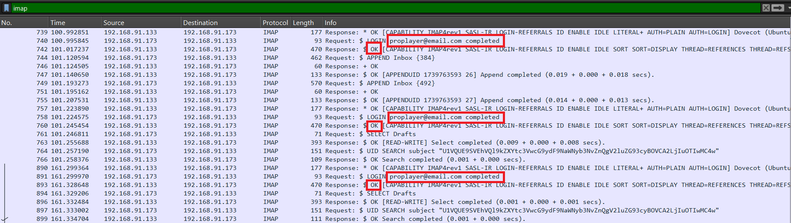

---

#### Question 5: What is the name of the task scheduled by the attacker? - Answer: `Synchronization`

Câu này mình bí nhưng nhờ hint của 0din mình đã làm được kkk.

Ta tiến hành phân tích con malware `.exe`. Vì dùng DetectItEasy ta biết được nó là `.NET` nên mình sẽ sử dụng `dnSpy`

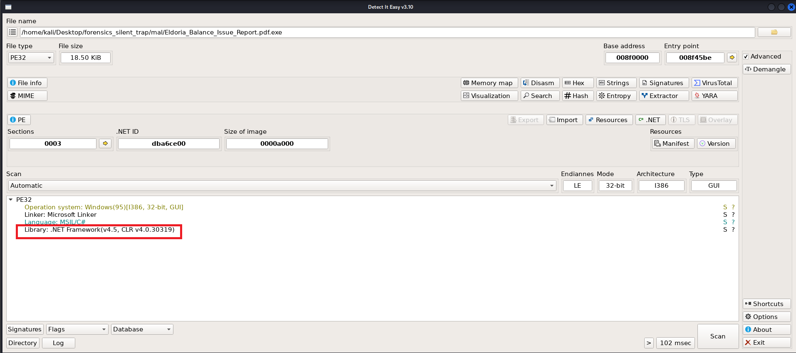

Ở đây có 2 classes, `Exor` thực hiện xử lý XOR RC4 gì đó và `Program` thực hiện chương trình. Bên trong `Program` có một function `execute`, đại loại nó sẽ load command từ mail, run nó và gửi kết quả đã bị encode Base64 và XOR(RC4) đi. Bên trong cũng có chứa key của RC4 để chúng ta decrypt.

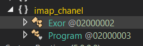

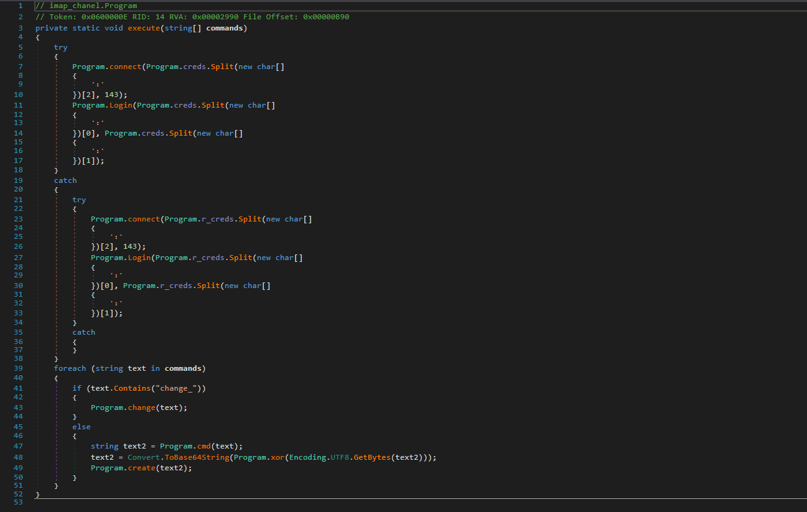

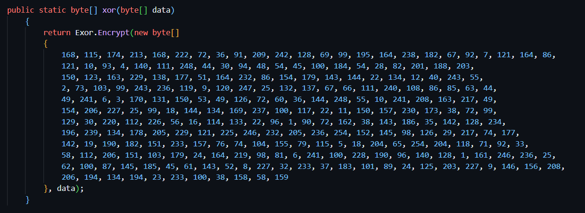

Sau khi hiểu được concept của nó rồi thì ta tiến hành decrypt thông tin: (Decode Base64 + Decrypt RC4 với key(Chuyển từ Decimal về Hex))

Note: Nếu ta để ý khi follow TCP stream thì nó sẽ có vài stream có chứa 1 đoạn encode base64 nhưng khi decode thì chưa ra cái gì cả thì nó chính là đoạn ta cần tìm cho phần này

Ta tìm và decrypt từng cái một thì ở TCP stream thứ 35, ta decrypt thì được 1 đoạn liên quan đến scheduled task và ta xác định được tên của nó là `Synchronization`

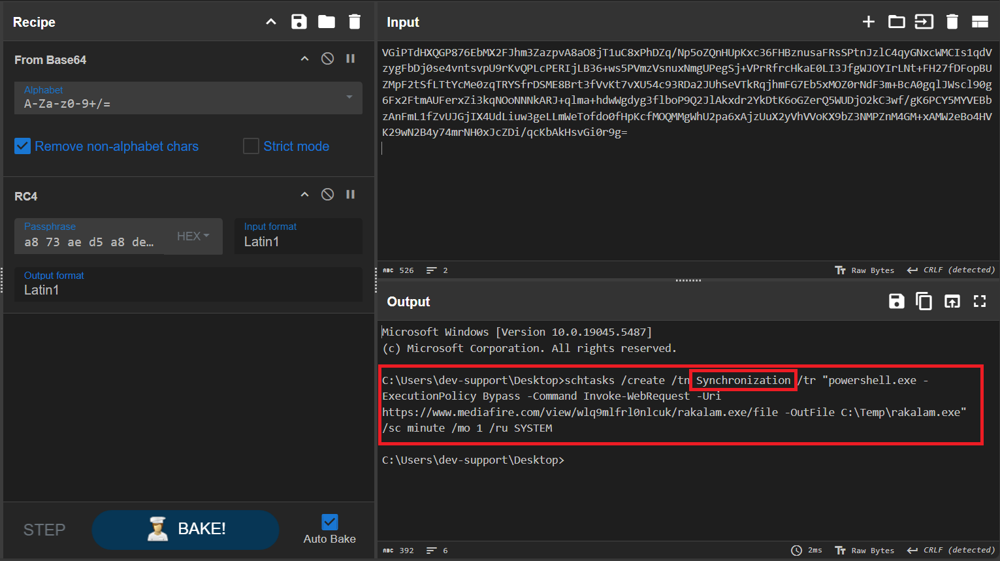

---

#### Question 6: What is the API key leaked from the highly valuable file discovered by the attacker? - Answer: `sk-3498fwe09r8fw3f98fw9832fw`

Làm tương tự câu 5, ở TCP stream thứ 97, ta decrypt thông tin và có được API key là `sk-3498fwe09r8fw3f98fw9832fw`

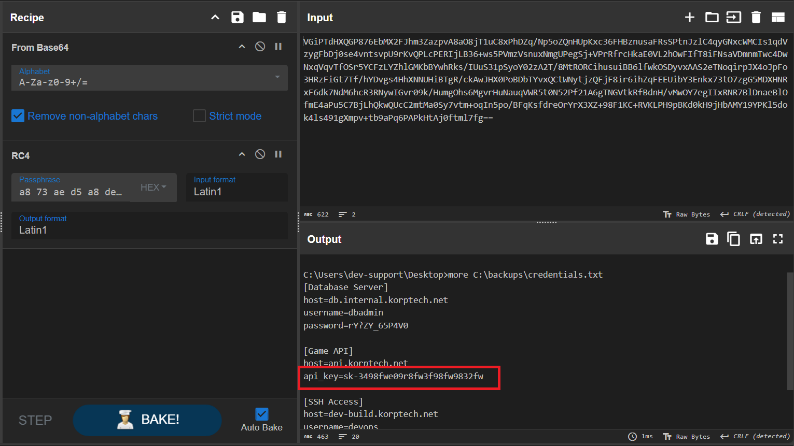

---

### Final Answer

| Question | Flag |
|---|----|
| 1. What is the subject of the first email that the victim opened and replied to? | Game Crash on Level 5 | 
| 2. On what date and time was the suspicious email sent? (Format: YYYY-MM-DD_HH:MM) | 2025-02-24_15:46 | 
| 3. What is the MD5 hash of the malware file? | c0b37994963cc0aadd6e78a256c51547 |
| 4. What credentials were used to log into the attacker's mailbox? (Format: username:password) | `proplayer@email.com:completed` |
| 5. What is the name of the task scheduled by the attacker? | Synchronization |
| 6. What is the API key leaked from the highly valuable file discovered by the attacker? | sk-3498fwe09r8fw3f98fw9832fw |
