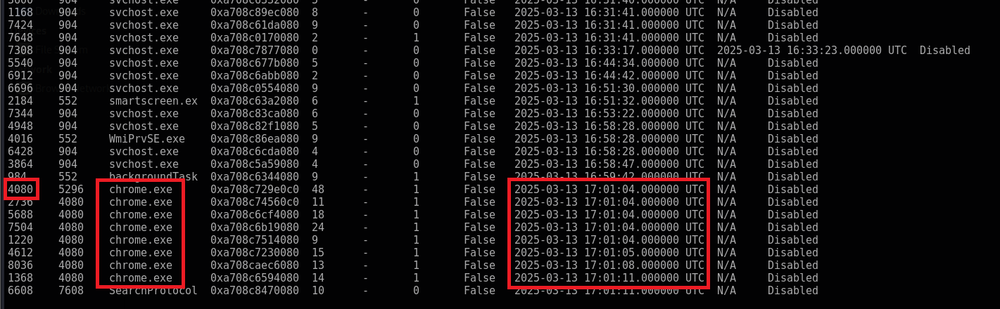
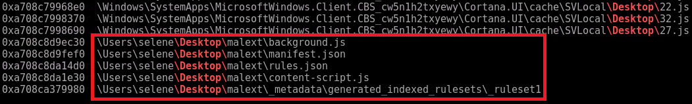
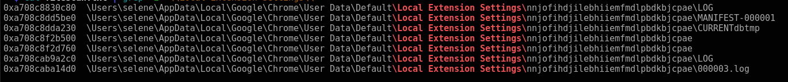
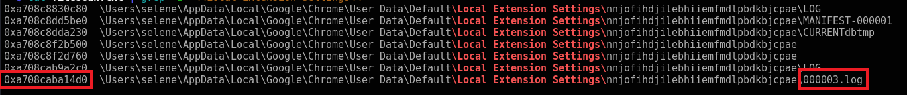
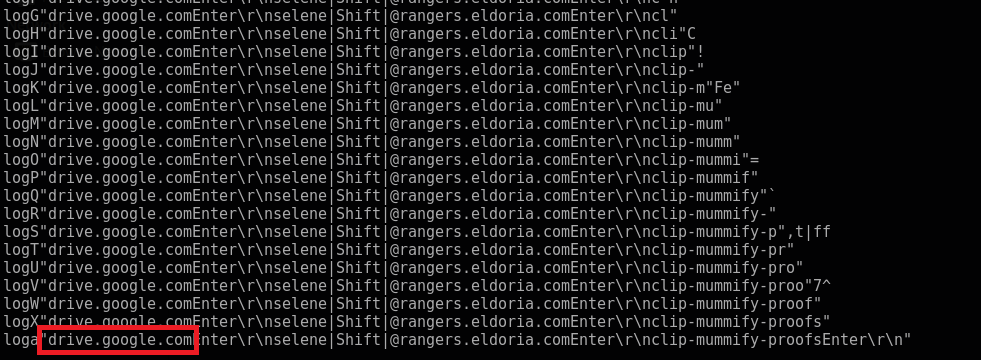
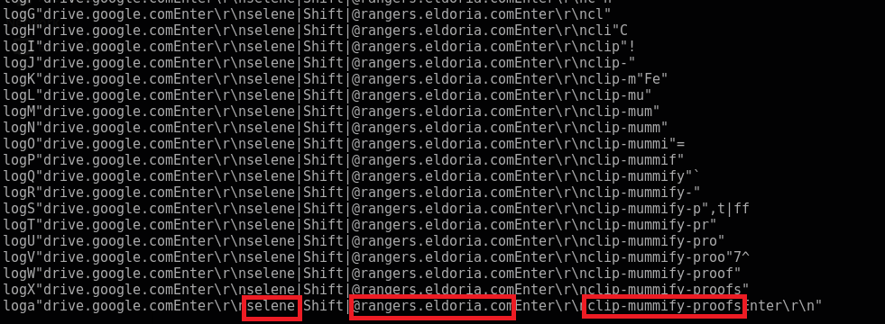

# Stealth Invasion

### Details:
Selene's normally secure laptop recently fell victim to a covert attack. Unbeknownst to her, a malicious Chrome extension was stealthily installed, masquerading as a useful productivity tool. Alarmed by unusual network activity, Selene is now racing against time to trace the intrusion, remove the malicious software, and bolster her digital defenses before more damage is done.

```
1. What is the PID of the Original (First) Google Chrome process?
2. What is the only Folder on the Desktop?
3. What is the Extention's ID (ex: hlkenndednhfkekhgcdicdfddnkalmdm)?
4. After examining the malicious extention's code, what is the log filename in which the datais stored?
5. What is the URL the user navigated to?
6. What is the password of selene@rangers.eldoria.com?
```

### Solution:

Chúng ta được cho 1 file memory dump, ta sẽ sử dụng `Volatility3` để giải quyết bài này

#### Question 1: What is the PID of the Original (First) Google Chrome process? - Answer: `4080`

Ta tiến hành check `PsList`:

```
python3 vol.py -f memdump.elf windows.pslist.PsList 
```



---

#### Question 2: What is the only Folder on the Desktop? - Answer: `malext`

Ta tiến hành check các file có trên memory bằng `FileScan`

```
python3 vol.py -f memdump.elf windows.filescan.FileScan
```

Ta chỉ cần `grep -i '\\Desktop\\'` là ra thôi



---

#### Question 3: What is the Extention's ID (ex: hlkenndednhfkekhgcdicdfddnkalmdm)? - Answer: `nnjofihdjilebhiiemfmdlpbdkbjcpae`

Trong Chrome những extension được tải từ Chrome Store sẽ được lưu ở `Google\Chrome\User Data\Default\Extensions`, tuy nhiên những extension add ngoài sẽ không có trong này. Mình tra thì nó sẽ ở `\Local Extension Settings\`

[Stack Overflow](https://superuser.com/a/944003)

Ta tiến hành `grep` thông tin với output của `FileScan`

```
python3 vol.py -f memdump.elf windows.filescan.FileScan | grep -i '\\Local Extension Settings\\' 
```



---

#### Question 4: After examining the malicious extention's code, what is the log filename in which the datais stored?  - Answer: `000003.log`

Ta nhìn lại ảnh ở câu 3, hỏi file `log` thì chỉ có `000003.log`

---

#### Question 5: What is the URL the user navigated to? - Answer: `drive.google.com`

Ta tiến hành dump file `000003.log` thông qua virtual address `--virtaddr`:



```
python3 vol.py -f memdump.elf windows.dumpfiles.DumpFiles --virtaddr=0xa708caba14d0
```

Ta check thông tin của file đã dump ra:

```
strings file.0xa708caba14d0.0xa708c9d90d00.DataSectionObject.000003.log.dat
```



#### Question 6: What is the password of selene@rangers.eldoria.com? - Answer: `clip-mummify-proofs`

Có vẻ malicious extention này ghi lại tiến trình ta gõ bàn phím để đánh cắp data. Ta nhìn đoạn đằng sau `selene@rangers.eldoria.com` thì đó là password



---

### Final Answer

| Question | Flag |
|---|----|
| 1. What is the PID of the Original (First) Google Chrome process? | 4080 | 
| 2. What is the only Folder on the Desktop? | malext | 
| 3. What is the Extention's ID (ex: hlkenndednhfkekhgcdicdfddnkalmdm)? | nnjofihdjilebhiiemfmdlpbdkbjcpae |
| 4. After examining the malicious extention's code, what is the log filename in which the datais stored? | 000003.log |
| 5. What is the URL the user navigated to? | drive.google.com |
| 6. What is the password of `selene@rangers.eldoria.com`? | clip-mummify-proofs |


