# ToolPie

### Detail:
In the bustling town of Eastmarsh, Garrick Stoneforge’s workshop site once stood as a pinnacle of enchanted lock and toolmaking. But dark whispers now speak of a breach by a clandestine faction, hinting that Garrick’s prized designs may have been stolen. Scattered digital remnants cling to the compromised site, awaiting those who dare unravel them. Unmask these cunning adversaries threatening the peace of Eldoria. Investigate the incident, gather evidence, and expose Malakar as the mastermind behind this attack.

```
1. What is the IP address responsible for compromising the website?
2. What is the name of the endpoint exploited by the attacker?
3. What is the name of the obfuscation tool used by the attacker?
4. What is the IP address and port used by the malware to establish a connection with the Command and Control (C2) server?
5. What encryption key did the attacker use to secure the data?
6. What is the MD5 hash of the file exfiltrated by the attacker?
```

### Solution

#### Question 1: What is the IP address responsible for compromising the website? - Answer: `194.59.6.66`

Ta phân tích HTTP traffic thì ta thấy ở stream thứ 3, ta thấy có 1 code obfuscated Python đang được upload từ một endpoint.

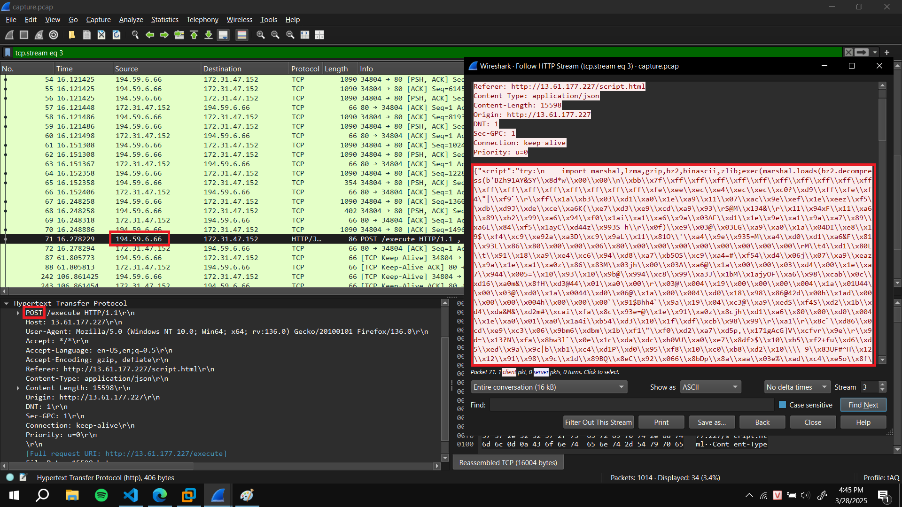 

---

#### Question 2: What is the name of the endpoint exploited by the attacker? - Answer: `execute`

Câu trả lời cũng ở câu 1 luôn, đó là `execute`

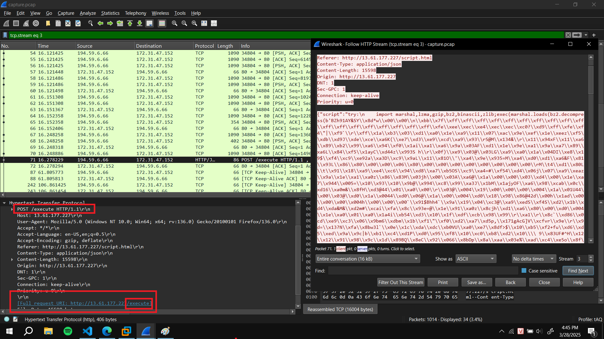

---

#### Question 3: What is the name of the obfuscation tool used by the attacker? - Answer: `Py-Fuscate`

Câu này ta phải tiến hành phân tích code obfuscate vừa rồi.

```
{"script":"\ntry:\n\timport marshal,lzma,gzip,bz2,binascii,zlib;exec(marshal.loads(bz2.decompress(b'BZh91AY&SY\\x8d*w\\x00\\x00\\n\\xbb\\x7f\\xff\\xff\\xff\\xff\\xff\\xff\\xff\\xff\\xff\\xff\\xff\\xff\\xff\\xff\\xff\\xff\\xff\\xff\\xfe\\xee\\xec\\xe4\\xec\\xec\\xc0?\\xd9\\xff\\xfe\\xf4\"|\\xf9`\\r\\xff\\x1a\\xb3\\x03\\xd1\\xa0\\x1e\\xa9\\x11\\x07\\xac\\x9e\\xef\\x1e\\xeez\\xf5\\xdb\\xd9J\\xde\\xce\\xa6K(\\xe7\\xd3\\xe9\\xcd\\xa9\\x93\\rS@M\\x134&\\r\\x11\\x94xF\\x11\\xa6\\x89\\xb2\\x99\\xa6\\x94\\xf0\\x1ai\\xa1\\xa6\\x9a\\x03AF\\xd1\\x1e\\x9e\\xa1\\x9a\\xa7\\x89\\xa6L\\x84\\xf5\\x1ayC\\xd44z\\x993S h\\r\\x0f)\\xe9\\x03@\\x03LG\\xa9\\xa0\\x1a\\x04DI\\xe8\\x19$\\xf4\\xc9\\xe92a\\xa3D\\xc9\\x9aL\\x11\\x81O\\'\\xa4\\x9e\\x935=M\\xa4\\xd0\\xd1\\xa6&F\\x81\\x93L\\x86\\x80\\x00\\x00\\x06\\x80\\x00\\x00\\x00
...................
\\xe0\\x00')))\nexcept KeyboardInterrupt:\n\texit()\n"}
```

Ta xử lý qua đoạn string (có 2 dấu '\\' liền nhau thì đổi thành còn 1) và sử dụng thêm module `dis` của Python. Đại loại nó sẽ giúp ta hiển thị và show bytecode của Python.

```python
import marshal,lzma,gzip,bz2,binascii,zlib
import dis

code =  b'BZh91AY&SY\x8d*w\x00\x00\n\xbb\x7f\xff\xff\xff\xff\xff\xff\xff\xff\xff\xff\xff\xff.....[DÀI QUÁ]........'
print(dis.dis(marshal.loads(bz2.decompress(code))))
```

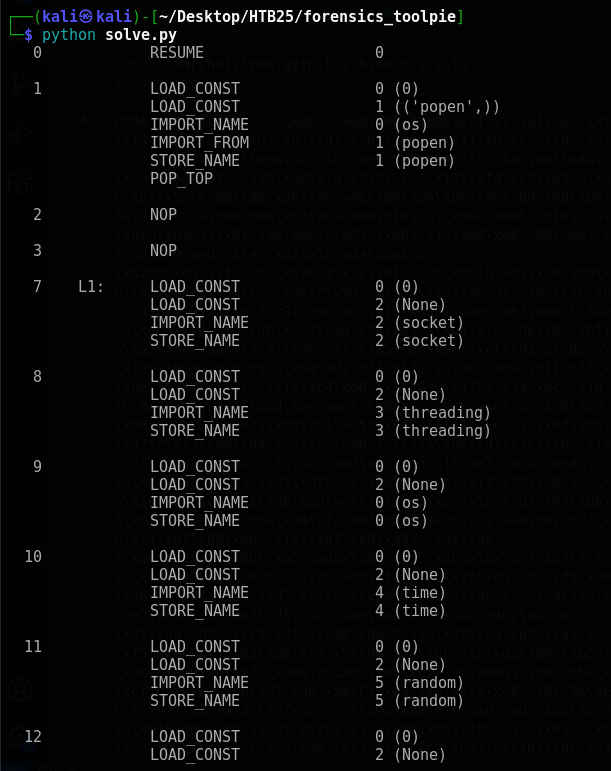

Ta nhìn xuống dưới thì có một đoạn có chứa tên của tool obfuscate `Py-Fuscate`

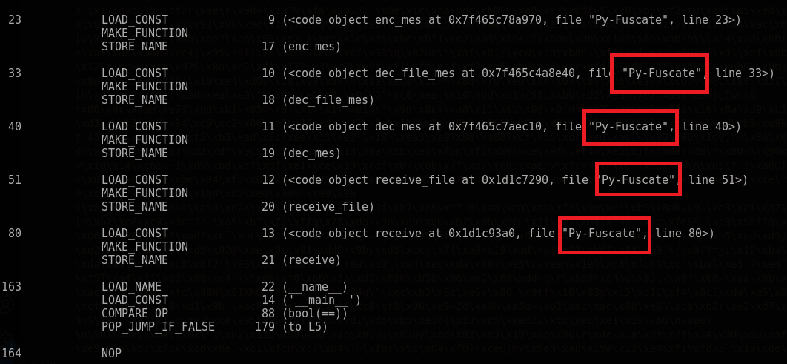

---

#### Question 4. What is the IP address and port used by the malware to establish a connection with the C2 server? - Answer: `13.61.7.218:55155`

Câu này kéo xuống dưới ta cũng biết được luôn nha

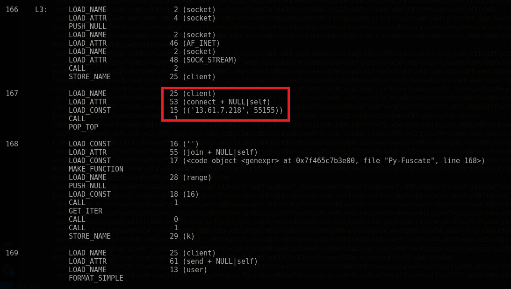

---

#### Question 5. What encryption key did the attacker use to secure the data? - Answer: `5UUfizsRsP7oOCAq`

Ta kéo xuống dòng data thứ `58, 59`. Nếu ta viết hẳn code của đoạn đó thì đoại loại nó là:

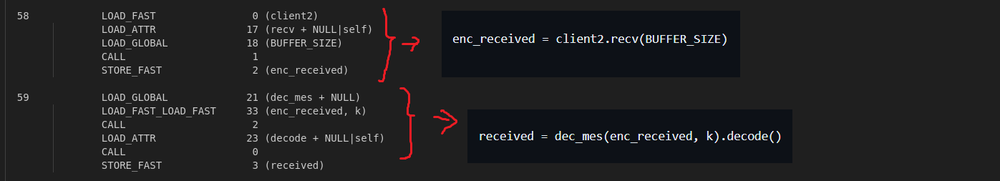

```python
# Dòng 58:
enc_received = client2.recv(BUFFER_SIZE)
# Dòng 59:
received = dec_mes(enc_received, k).decode()
```

Đại loại nó client sẽ nhận thông tin và decrypt thông tin đó với key `k`. Ta đã xác định được key tên là `k` rồi thì tiếp tục kéo xuống dưới xem `k` nó trông như thế nào. Vào dòng 156 ta có thông tin của nó.

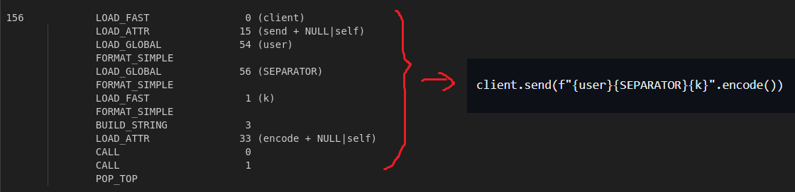 

Ta phục hồi đc code ban đầu: `client.send(f"{user}{SEPARATOR}{k}".encode())`. Ta biết được `key` sẽ đứng sau cái gọi là `<SEPARATOR>` nên follow theo TCP stream ta tìm được giá trị của key đó.

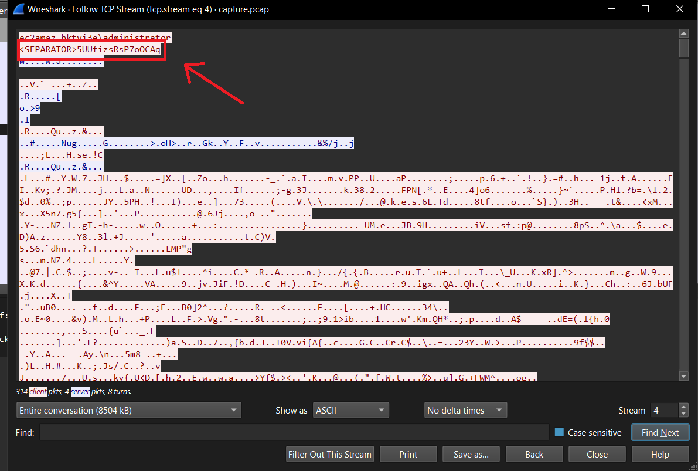

---

#### Question 6. What is the MD5 hash of the file exfiltrated by the attacker? - Answer: `8fde053c8e79cf7e03599d559f90b321`

Trong đoạn output sử dụng `dis` của ta có nói về việc sử dụng `AES`.

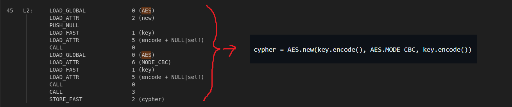

Ta phục hồi được code ban đầu của nó: `cypher = AES.new(key.encode(), AES.MODE_CBC, key.encode())`. Đại loại nó sẽ dùng AES, có key và IV = key **????? (really?)**

Ta tiến hành extract data từ 13.61.7.218:55155 và decrypt thông tin.

```
tshark -r capture.pcap -Y "ip.addr == 13.61.7.218 && tcp.dstport == 55155" -T fields -e data.data > extract.data
```

Và t đút vô CyberChef (xóa một số thông tin thừa ở đầu của extract.data đi) và tiến hành decrypt AES và có được file `pdf`

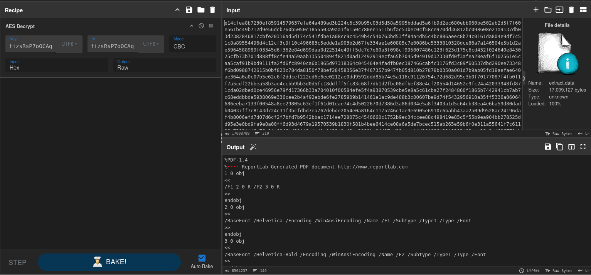

Save nó và check MD5 hash của file là có kết quả của câu 6

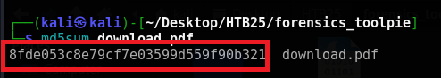

---

### Final Answer


| Question | Flag |
|---|----|
| 1. What is the IP address responsible for compromising the website? | 194.59.6.66 | 
| 2. What is the name of the endpoint exploited by the attacker? | execute | 
| 3. What is the name of the obfuscation tool used by the attacker? | Py-Fuscate |
| 4. What is the IP address and port used by the malware to establish a connection with the Command and Control (C2) server? (Format: username:password) | `13.61.7.218:55155` |
| 5. What encryption key did the attacker use to secure the data? | 5UUfizsRsP7oOCAq |
| 6. What is the MD5 hash of the file exfiltrated by the attacker? | 8fde053c8e79cf7e03599d559f90b321 |
